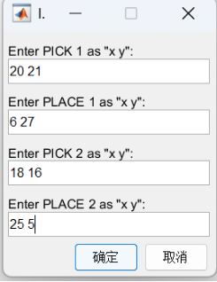

# ECE5463 Final Project (Pick and Place)
## --Tongyuan liu

### Code Dependency：
1.  Youtube "ENGR 1315 - MATLAB - inputdlg to Create Kinematics Calculator"
https://www.youtube.com/watch?v=61HeXe64A6Y
2. Youtube "How to move object on a curve in Matlab" 
https://www.youtube.com/watch?v=lDMSZ3tCq5I
3. Youtube "Equations of Motion for the Multi Degree of Freedom (MDOF) Problem Using LaGrange's Equations"
https://www.youtube.com/watch?v=uAKD5CGZuSs
4. Modern Robotics, Chapters 9.1 and 9.2: Point-to-Point Trajectories (Part 2 of 2)
Youtube video: https://www.youtube.com/watch?v=0ZqeBEa_MWo
5. Lecture note 11 and 17
6. Indivitual work: HW4_Q3 and PA3

### How to use
1. Run the code, in to user UI. Example are shown in the figure.

2. click "确定" or "Yes"

### Platform used
Matlab R2020b
